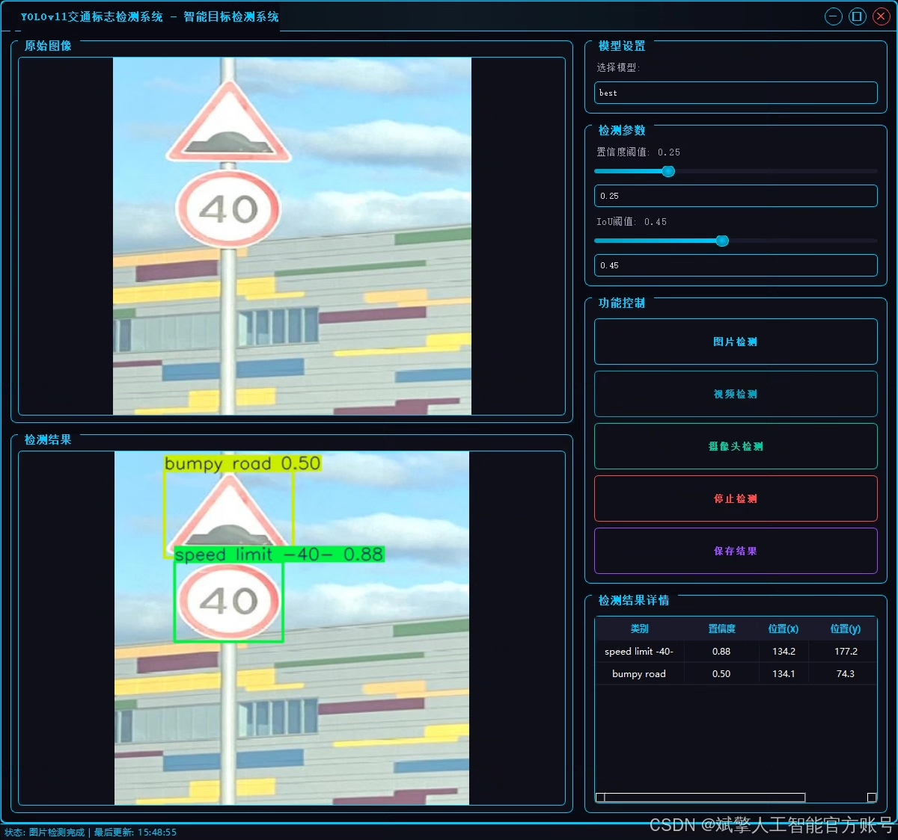
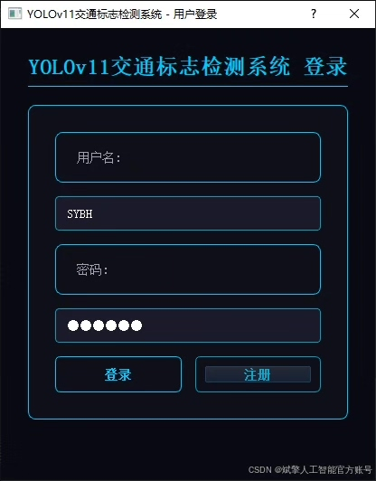
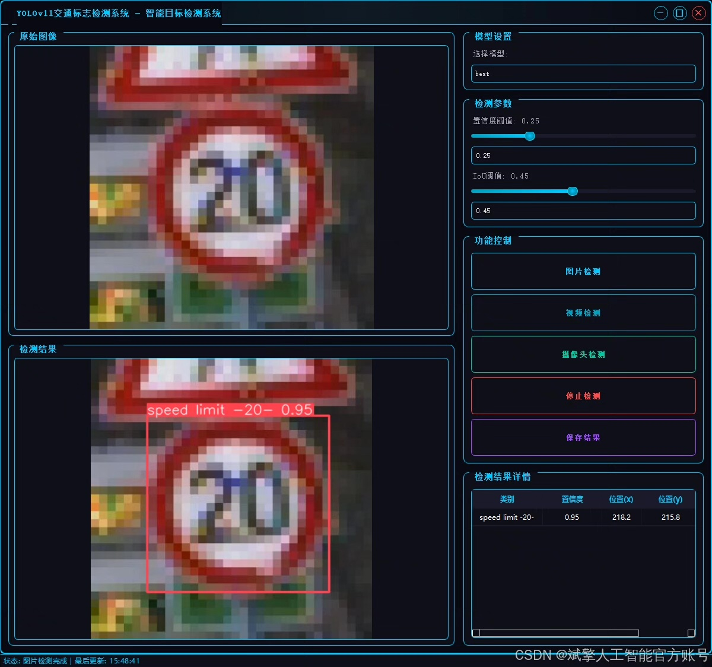
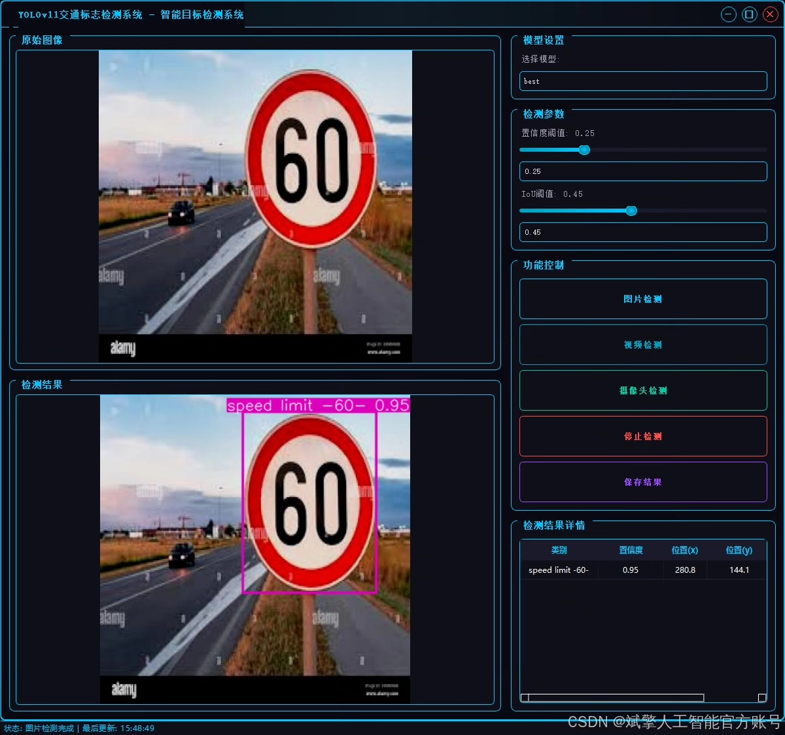
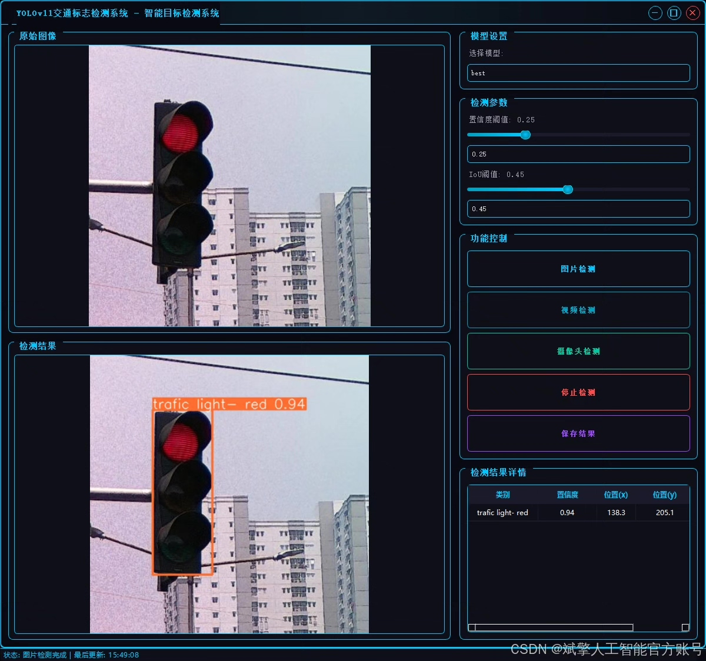
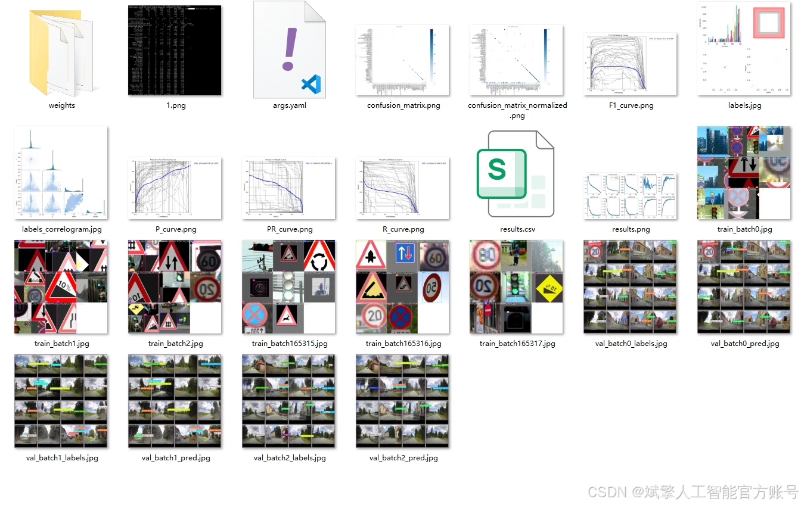
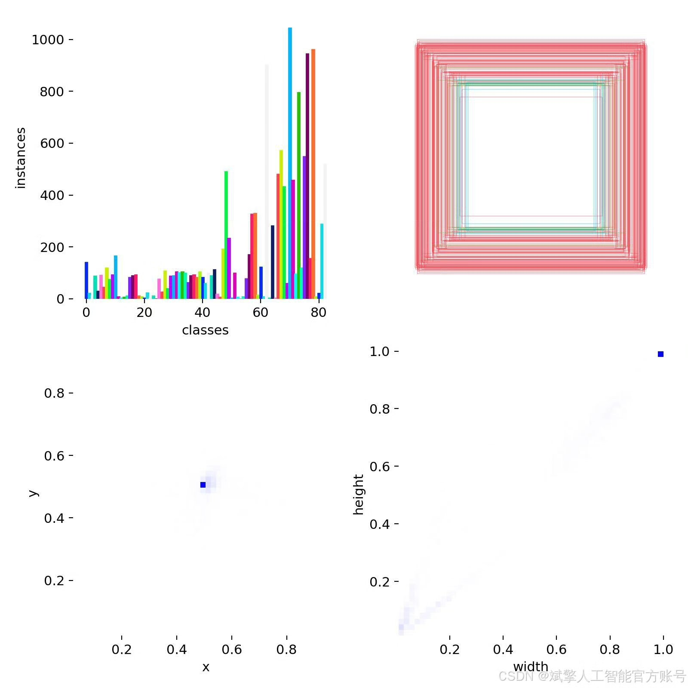
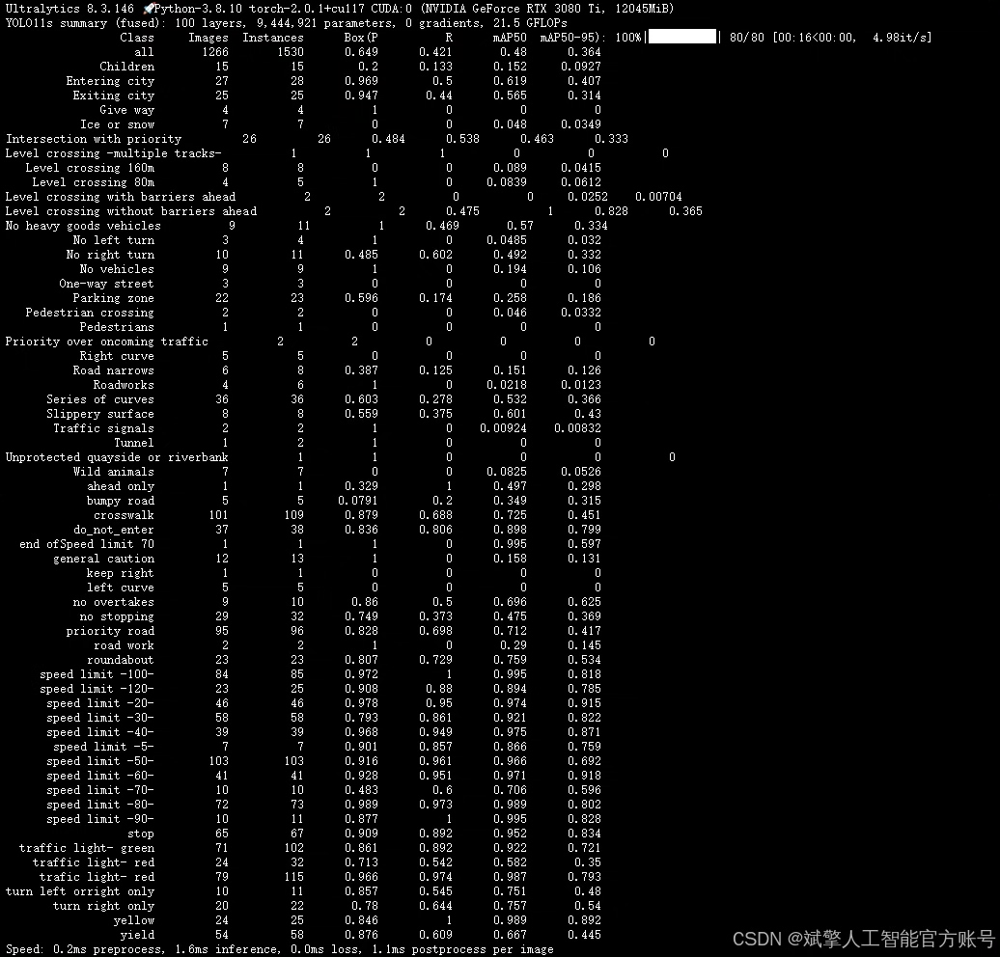
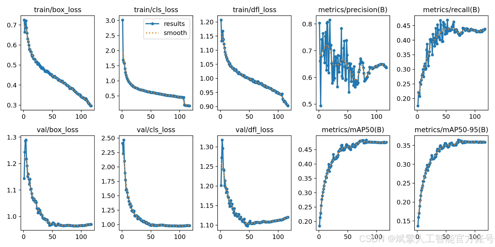

# YOLOv11 Traffic Sign Recognition System

## Body

YOLOv11 Traffic Sign Recognition System is a detection system based on deep learning YOLOv11. It includes the following components:

1. YOLOv11 dataset: The dataset contains images of traffic signs and their corresponding labels.

2. UI interface: A user-friendly interface that allows users to interact with the system.

3. Login and registration interface: A simple interface for users to log in and register.

4. Python project source code: The source code for the system, including the YOLOv11 model and other necessary files.

5. Model: The YOLOv11 model used for traffic sign recognition.

NC:83

Name: ['Children', 'Entering city', 'Exiting city', 'Falling rocks', 'Fog', 'Give way', 'Ice or snow', 'Intersection with priority', 'Intersection without priority', 'Level crossing -multiple tracks-', 'Level crossing 160m', 'Level crossing 240m', 'Level crossing 80m', 'Level crossing with barriers ahead', 'Level crossing without barriers ahead', 'Level crossing', 'Loose surface material', 'Low-flying aircraft', 'No heavy goods vehicles', 'No left turn', 'No overtaking by heavy goods vehicles', 'No right turn', 'No vehicles carrying dangerous goods', 'No vehicles', 'One-way street', 'Opening bridge', 'Parking zone', 'Pedestrian crossing', 'Pedestrians', 'Priority over oncoming traffic', 'Right curve', 'Road narrows', 'Roadworks', 'Series of curves', 'Slippery surface', 'Soft verges', 'Steep ascent', 'Steep descent', 'Traffic queues', 'Traffic signals', 'Trams', 'Tunnel', 'Two-way traffic', 'Unprotected quayside or riverbank', 'Wild animals', 'ahead only', 'ahead or right', 'bumpy road', 'crosswalk', 'do_not_enter', 'end ofSpeed limit 70', 'general caution', 'keep right', 'left curve', 'no admittance', 'no overtakes', 'no stopping', 'no_parking', 'priority road', 'road work', 'roundabout', 'slippery road', 'speed limit -100-', 'speed limit -110-', 'speed limit -120-', 'speed limit -130-', 'speed limit -20-', 'speed limit -30-', 'speed limit -40-', 'speed limit -5-', 'speed limit -50-', 'speed limit -60-', 'speed limit -70-', 'speed limit -80-', 'speed limit -90-', 'stop', 'traffic light- green', 'traffic light- red', 'trafic light- red', 'turn left orright only', 'turn right only', 'yellow', 'yield']

Dataset Size: Training set 12,356 images, validation set 1,266 images, test set 654 images.

✅ User Login and Signup: Supports password detection and security verification.

✅ Three detection modes: based on the YOLOv11 model, support image, video and real-time camera three detection, accurate recognition of targets.

✅ Dual-screen comparison: Display the original image and the detection result on the same screen.

✅ Data Visualization: Real-time table display of detection target categories, confidence and coordinates.

✅ Intelligent Parameter Tuning: Offers a confidence slide, dynamically optimizes detection accuracy to meet different scene requirements.

✅ Sci-fi style interactive interface: dark theme combined with dynamic light effects, reducing visual fatigue and improving operational experience.

## Images

## Payment

Here is a pay link on Stripe ( https://buy.stripe.com/3cs8yP7sY87d0vu9AB ). Please contact me lonlonago@foxmail.com after funding $89, and I will send you a complete data files , thank you!

